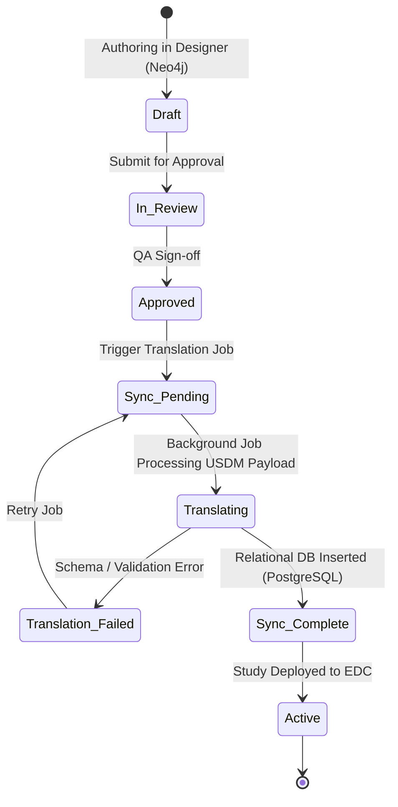

# Data Standards & Interoperability Blueprint

## Document Metadata
- **Document Version:** 1.0.0-PROD
- **Status:** APPROVED / GxP-BASELINE
- **Target Audience:** Clinical Data Managers, Biostatisticians, System Integration Architects, Medical Directors
- **Standards Alignment:** CDISC SDTM v2.0 / ADaM v1.3 / CDASH v2.1, ISO 14155:2020, ICH E6(R2)/E9, 21 CFR Part 11, EU Annex 11, HIPAA Safe Harbor, GDPR.

---

## Table of Contents
1. **Executive Summary & Scope of Interoperability**
2. **CDISC Data Mapping Governance & Transformations**
   - 2.1 CDASH Form Generation Rules and Metadata Mapping
   - 2.2 SDTM Domain Extraction and Mapping Architecture
   - 2.3 ADaM Dataset Metadata Alignment & Derivation Rules
3. **Medical Terminology & Dictionary Coding Engine**
   - 3.1 Automated Coding Engine Architecture
   - 3.2 Coding Workflow, Overrides, and Query Management
   - 3.3 Dictionary Up-Versioning Impact Logic
4. **Biomedical Concepts & Data Modeling**
   - 4.1 Biomedical Concepts (BC) Meta-Model
   - 4.2 Null Flavor Rules and Missing Data Logic
   - 4.3 Unit Conversion Matrices (UCUM Standards)
   - 4.4 Missing Data Imputation Logic
   - 4.5 Statistical Outlier Detection Engine
   - 4.6 Data Anonymization & De-identification Policies

---

## 1. Executive Summary & Scope of Interoperability

This document defines the comprehensive governance, algorithmic logic, and metadata transformation models that drive clinical data standards and system-wide interoperability within the Cadence Clinical platform. In order to realize an automated Digital Data Flow (DDF), this platform bridges the gap between upstream Clinical Metadata Management (MDR) and downstream Electronic Data Capture (EDC) transaction engines.

Historically, clinical trial setup has suffered from extreme fragmentation: CDASH-compliant eCRF forms are built in silos, SDTM datasets are mapped manually post-database lock, and ADaM statistical datasets are programmed from scratch for every study. The Cadence Clinical platform eliminates these barriers by enforcing a single, unified, graph-driven metadata foundation based on the CDISC Unified Study Definitions Model (USDM) and ISO 14155:2020.

```
       ┌────────────────────────┐
       │   Biomedical Concept   │
       │     Graph (MDR)        │
       └───────────┬────────────┘
                   │ Enforces Variables
                   ▼
       ┌────────────────────────┐
       │ CDASH eCRF Form Engine │
       └───────────┬────────────┘
                   │ Captures Verbatim
                   ▼
       ┌────────────────────────┐
       │  SDTM Domain Engine    │
       └───────────┬────────────┘
                   │ Traverses Relationships
                   ▼
       ┌────────────────────────┐
       │  ADaM Analysis Engine  │
       └────────────────────────┘
```

The system ensures that any clinical data variable captured in an eCRF carries its semantic heritage, validation constraints, unit normalization equations, and medical coding parameters throughout its entire lifecycle. By automating the transformation paths from CDASH to SDTM and SDTM to ADaM, the platform minimizes human error, guarantees submission compliance, and drastically reduces the timeline from Last Subject Last Visit (LSLV) to statistical analysis.

---

## 2. CDISC Data Mapping Governance & Transformations

### 2.1 CDASH Form Generation Rules and Metadata Mapping

The Cadence Clinical platform automatically compiles CDASH-compliant eCRFs from USDM-based Biomedical Concepts stored in the Neo4j Graph Database. The eCRF generation engine translates logical concepts into OpenRosa / Enketo XForm definitions using precise, deterministic rules:

1. **CDASH Variable Naming Conventions:** Every form item must inherit its base variable name from the CDASH standard. For example, the "Date of Birth" question must map to `BRTHDTC`. Form variables must have a prefix representing the domain (e.g., `VS` for Vital Signs, `AE` for Adverse Events) followed by the root variable identifier (e.g., `VS.VSORRES` for Vital Signs Original Result).
2. **Metadata-Driven Layouts:** Row, group, and grid structures are derived directly from the relationships between concepts. Repeating grids (e.g., for concomitant medications) map to `<repeat>` nodes in XForms, maintaining strict XML hierarchies.
3. **Validation Constraint Binding:** Value-level constraints defined in the MDR (e.g., systolic blood pressure between 40 and 250 mmHg) are compiled into XPath `constraint` attributes within the XForm body, forcing immediate, real-time client-side validation.
4. **Visibility / Skip Logic:** Conditional rendering rules use XPath expressions pointing to parent elements. For instance, the prompt to describe a "Other" race category is governed by `relevant="/data/DM/RACE = 'OTHER'"`.

---

### 2.2 SDTM Domain Extraction and Mapping Architecture

SDTM datasets are generated using a graph-based extractor engine that traverses relationships between transactional clinical data payloads (relational PostgreSQL tables) and the logical USDM study design graph. Non-standard variables are automatically mapped to supplemental qualifiers (`SUPP--` domains) to ensure zero data loss while maintaining absolute SDTM compliance.

The following table provides variable-level mappings from CDASH verbatim inputs to SDTM domain variables across five core clinical domains: Demographics (DM), Adverse Events (AE), Vital Signs (VS), Laboratory Findings (LB), and Medical History (MH).

| SDTM Domain | SDTM Variable | CDASH Source Field | Data Type | Transformation / Mapping Rule |
| :--- | :--- | :--- | :--- | :--- |
| **DM** | `STUDYID` | `Metadata.StudyID` | Char | Direct copy of the unique protocol identifier. |
| **DM** | `USUBJID` | `Subject.UID` | Char | Concatenation of `STUDYID`, Site ID (`SITEID`), and Subject ID (`SUBJID`): `STUDYID-SITEID-SUBJID`. |
| **DM** | `SUBJID` | `Subject.ID` | Char | Direct copy of the site-specific subject number. |
| **DM** | `RFSTDTC` | `EX.EXSTDTC` | Char | Date/Time of first study treatment exposure. Imputed as ISO 8601 string. |
| **DM** | `RFENDTC` | `DS.DSSTDTC` | Char | Date/Time of last study exposure or study completion/withdrawal. |
| **DM** | `BRTHDTC` | `DM.BRTHDTC` | Char | Date of birth in ISO 8601 format (`YYYY-MM-DD`). Partial dates allowed. |
| **DM** | `AGE` | Computed | Num | Computed as `floor((RFSTDTC - BRTHDTC) / 365.25)`. |
| **DM** | `AGEU` | Fixed Value | Char | Static value set to `"YEARS"`. |
| **DM** | `SEX` | `DM.SEX` | Char | Checked against CDISC Controlled Terminology (`"M"`, `"F"`, `"U"`). |
| **DM** | `RACE` | `DM.RACE` | Char | Checked against CDISC Controlled Terminology. If multiple checked, set to `"MULTIPLE"`. |
| **DM** | `ARM` | `Randomization.Arm` | Char | Set to the randomized trial arm description. Defaults to `"SCREEN FAILURE"` if not randomized. |
| **AE** | `STUDYID` | `Metadata.StudyID` | Char | Direct copy of the unique protocol identifier. |
| **AE** | `USUBJID` | `Subject.UID` | Char | Derived unique subject identifier. |
| **AE** | `AESEQ` | System Generated | Num | Monotonically increasing sequence integer per subject, sorted by `AESTDTC`. |
| **AE** | `AETERM` | `AE.AETERM` | Char | Verbatim term of the adverse event as entered by investigator. |
| **AE** | `AELOC` | `AE.AELOC` | Char | Anatomical location, if applicable. Maps to custom qualifiers if non-standard. |
| **AE** | `AELDTC` | Computed | Char | Date/Time of local adverse event onset (captured on device). |
| **AE** | `AESTDTC` | `AE.AESTDTC` | Char | Start date/time of adverse event in ISO 8601 format. Partial dates allowed. |
| **AE** | `AEENDTC` | `AE.AEENDTC` | Char | End date/time of adverse event. If ongoing, set to null and flag `AEENGRY` as `"ONGOING"`. |
| **AE** | `AESEV` | `AE.AESEV` | Char | Mapped to CDISC CT: `"MILD"`, `"MODERATE"`, `"SEVERE"`. |
| **AE** | `AESER` | `AE.AESER` | Char | Serious Adverse Event flag: `"Y"` or `"N"`. |
| **AE** | `AEREL` | `AE.AEREL` | Char | Relationship to treatment: `"RELATED"`, `"NOT RELATED"`, `"POSSIBLY RELATED"`. |
| **AE** | `AEOUT` | `AE.AEOUT` | Char | Outcome: `"RECOVERED/RESOLVED"`, `"RECOVERING/RESOLVING"`, `"FATAL"`, etc. |
| **VS** | `STUDYID` | `Metadata.StudyID` | Char | Direct copy of unique protocol identifier. |
| **VS** | `USUBJID` | `Subject.UID` | Char | Derived unique subject identifier. |
| **VS** | `VSSEQ` | System Generated | Num | Monotonically increasing sequence integer per subject, sorted by `VSDTC`. |
| **VS** | `VSTESTCD` | `VS.VSTESTCD` | Char | Short test code (e.g., `"SYSBP"`, `"DIABP"`, `"PULSE"`, `"TEMP"`, `"HEIGHT"`, `"WEIGHT"`). |
| **VS** | `VSTEST` | `VS.VSTEST` | Char | Full test name (e.g., `"Systolic Blood Pressure"`, `"Pulse Rate"`). |
| **VS** | `VSORRES` | `VS.VSORRES` | Num | Original verbatim result captured in eCRF. |
| **VS** | `VSORRESU` | `VS.VSORRESU` | Char | Original unit (e.g., `"mmHg"`, `"beats/min"`, `"[degF]"`). |
| **VS** | `VSSTRESC` | Computed | Char | Standardized result represented as a character string. |
| **VS** | `VSSTRESN` | Computed | Num | Standardized numeric result. Converted to UCUM standards (see Section 4.3). |
| **VS** | `VSSTRESU` | Computed | Char | Standardized unit derived from UCUM target standards (e.g., `"mmHg"`, `"Cel"`). |
| **VS** | `VSPOS` | `VS.VSPOS` | Char | Subject position during measurement: `"SUPINE"`, `"SITTING"`, `"STANDING"`. |
| **VS** | `VSDTC` | `VS.VSDTC` | Char | Date/Time of vital signs measurement in ISO 8601 format. |
| **VS** | `VSBLFL` | Computed | Char | Vital signs Baseline Flag: Set to `"Y"` if baseline record, otherwise null. |
| **LB** | `STUDYID` | `Metadata.StudyID` | Char | Direct copy of unique protocol identifier. |
| **LB** | `USUBJID` | `Subject.UID` | Char | Derived unique subject identifier. |
| **LB** | `LBSEQ` | System Generated | Num | Monotonically increasing sequence integer, sorted by `LBDTC` and `LBSPEC`. |
| **LB** | `LBTESTCD` | `LB.LBTESTCD` | Char | Lab test short code (e.g., `"ALT"`, `"AST"`, `"CREAT"`, `"GLUC"`, `"HEMOG"`). |
| **LB** | `LBTEST` | `LB.LBTEST` | Char | Full lab test name (e.g., `"Alanine Aminotransferase"`, `"Glucose"`). |
| **LB** | `LBORRES` | `LB.LBORRES` | Char | Original verbatim result (alphanumeric). |
| **LB** | `LBORRESU` | `LB.LBORRESU` | Char | Original result unit. |
| **LB** | `LBSTRESC` | Computed | Char | Standardized character result. |
| **LB** | `LBSTRESN` | Computed | Num | Standardized numeric result. Standardized using UCUM matrices. |
| **LB** | `LBSTRESU` | Computed | Char | Standardized unit (e.g., `"g/L"`, `"umol/L"`). |
| **LB** | `LBNRIND` | Computed | Char | Normal range reference indicator: `"LOW"`, `"NORMAL"`, `"HIGH"`. |
| **LB** | `LBDTC` | `LB.LBDTC` | Char | Date/Time of specimen collection in ISO 8601 format. |
| **LB** | `LBLOINC` | `LB.LBLOINC` | Char | LOINC code mapped to the lab test. |
| **MH** | `STUDYID` | `Metadata.StudyID` | Char | Direct copy of unique protocol identifier. |
| **MH** | `USUBJID` | `Subject.UID` | Char | Derived unique subject identifier. |
| **MH** | `MHSEQ` | System Generated | Num | Monotonically increasing sequence integer, sorted by `MHDTC`. |
| **MH** | `MHTERM` | `MH.MHTERM` | Char | Medical history verbatim term. |
| **MH** | `MHDECOD` | Computed | Char | MedDRA Preferred Term (PT) code derived from dictionary coding (Section 3). |
| **MH** | `MHBODSYS` | Computed | Char | MedDRA System Organ Class (SOC) description. |
| **MH** | `MHSTDTC` | `MH.MHSTDTC` | Char | Onset date of medical history condition in ISO 8601 format. Partial dates common. |
| **MH** | `MHENDTC` | `MH.MHENDTC` | Char | End date of medical history condition. Null if ongoing. |
| **MH** | `MHENRTP` | `MH.MHENRTP` | Char | Relationship to study start: `"BEFORE"`, `"ONGOING"`. |

---

### 2.3 ADaM Dataset Metadata Alignment & Derivation Rules

ADaM datasets contain the analytical representation of clinical data, structured to support statistical analysis directly. Every ADaM variable must be defined with clear, unambiguous metadata derivation rules.

We define below the core derivation guidelines and mapping matrices for three fundamental ADaM datasets: Subject-Level Analysis Dataset (ADSL), Adverse Events Analysis Dataset (ADAE), and Vital Signs Analysis Dataset (ADVS).

#### 2.3.1 Subject-Level Analysis Dataset (ADSL) Derivations
ADSL is unique as it contains exactly one record per randomized subject, consolidating foundational trial milestones, demographics, and stratification parameters.

```
       ┌───────────────┐
       │ SDTM DM (Demo)│ ──┐
       └───────────────┘   │
       ┌───────────────┐   │
       │ SDTM EX (Expos)│ ─┼─► [ ADSL Dataset ]
       └───────────────┘   │   (1 record per subject)
       ┌───────────────┐   │
       │ SDTM DS (Dispo)│ ──┘
       └───────────────┘
```

| ADaM Dataset | ADaM Variable | Source SDTM Variable(s) | Derivation Algorithm & Business Rules |
| :--- | :--- | :--- | :--- |
| **ADSL** | `STUDYID` | `DM.STUDYID` | Direct copy from SDTM DM. |
| **ADSL** | `USUBJID` | `DM.USUBJID` | Direct copy from SDTM DM. |
| **ADSL** | `SUBJID` | `DM.SUBJID` | Direct copy from SDTM DM. |
| **ADSL** | `SITEID` | `DM.SITEID` | Direct copy from SDTM DM. |
| **ADSL** | `ARM` | `DM.ARM` | Direct copy from SDTM DM. |
| **ADSL** | `ACTARM` | `EX.EXTRT` | Actual Treatment Arm. Determined by evaluating actual study drug exposure records in SDTM EX. If treatment deviated, set to actual treatment received. |
| **ADSL** | `TRT01P` | `DM.ARM` | Planned Treatment for Period 01. Direct copy of randomized treatment arm (`ARM`). |
| **ADSL** | `TRT01A` | Computed | Actual Treatment for Period 01. Map to `ACTARM`. |
| **ADSL** | `TRTSDT` | `EX.EXSTDTC` | Treatment Start Date (Numeric). Converted to SAS/numeric date. Represents the earliest exposure date across all study drugs. |
| **ADSL** | `TRTEDT` | `EX.EXENDTC` | Treatment End Date (Numeric). Converted to SAS/numeric date. Represents the latest exposure date across all study drugs. |
| **ADSL** | `RANDT` | `DS.DSSTDTC` | Randomization Date (Numeric). Extracted from SDTM DS where `DSDECOD = 'RANDOMIZED'`. Converted to numeric date. |
| **ADSL** | `DTHDT` | `DM.DTHDTC` | Death Date (Numeric). Converted to numeric date if `DTHDTC` is populated in DM. |
| **ADSL** | `EOSDT` | `DS.DSSTDTC` | End of Study Date (Numeric). Extracted from SDTM DS where `DSCAT = 'DISPOSITION EVENT'` and `DSSCAT = 'STUDY COMPLETION/WITHDRAWAL'`. |
| **ADSL** | `SAFFL` | `EX.EXSTDTC` | Safety Population Flag. Set to `"Y"` if subject took at least one dose of study medication (i.e., `TRTSDT` is not null), otherwise `"N"`. |
| **ADSL** | `ITTFL` | `DS.DSDECOD` | Intent-To-Treat Population Flag. Set to `"Y"` if subject was randomized (i.e., `RANDT` is not null), otherwise `"N"`. |

#### 2.3.2 Occurrence Data Structure: Adverse Events Analysis Dataset (ADAE)
ADAE is modeled using the ADaM Occurrence Data Structure (OCCDS). It supports the analysis of adverse event rates, severity, and relation to study drug.

```
       ┌───────────────┐
       │  SDTM AE Record│ ────┐
       └───────────────┘     │
       ┌───────────────┐     ├─► [ ADAE OCCDS Record ]
       │  ADSL TRTSDT  │ ────┘   (Calculates relative days,
       └───────────────┘          treatment emergent flags)
```

| ADaM Dataset | ADaM Variable | Source SDTM / ADaM Variable | Derivation Algorithm & Business Rules |
| :--- | :--- | :--- | :--- |
| **ADAE** | `USUBJID` | `AE.USUBJID` | Direct copy from SDTM AE. |
| **ADAE** | `ASTDT` | `AE.AESTDTC` | Analysis Start Date (Numeric). Converted from SDTM ISO 8601 string `AESTDTC`. If date is partial, apply partial date imputation rules (Section 4.4). |
| **ADAE** | `AENDT` | `AE.AEENDTC` | Analysis End Date (Numeric). Converted from SDTM ISO 8601 string `AEENDTC`. If partial, apply imputation rules. |
| **ADAE** | `ASTDY` | `ASTDT`, `ADSL.TRTSDT` | Analysis Start Relative Day. Computed as: <br> If `ASTDT >= TRTSDT` then `ASTDT - TRTSDT + 1`. <br> If `ASTDT < TRTSDT` then `ASTDT - TRTSDT`. |
| **ADAE** | `AENDY` | `AENDT`, `ADSL.TRTSDT` | Analysis End Relative Day. Computed using the same relative day logic as `ASTDY`. |
| **ADAE** | `TRTEMFL` | `ASTDT`, `ADSL.TRTSDT` | Treatment Emergent Adverse Event Flag. Set to `"Y"` if `ASTDT >= TRTSDT` and `ASTDT <= ADSL.TRTEDT + 30` (30-day safety window). Otherwise `"N"`. |
| **ADAE** | `AEDECOD` | `AE.AEDECOD` | Preferred Term (PT) dictionary code. Direct copy from SDTM AE. |
| **ADAE** | `AEBODSYS` | `AE.AEBODSYS` | System Organ Class (SOC) dictionary term. Direct copy from SDTM AE. |
| **ADAE** | `AESEV` | `AE.AESEV` | Verbatim Severity. Direct copy from SDTM AE. |
| **ADAE** | `AESEVN` | `AE.AESEV` | Severity Numeric Grade. Map `"MILD"` to `1`, `"MODERATE"` to `2`, `"SEVERE"` to `3`. |

#### 2.3.3 Basic Data Structure: Vital Signs Analysis Dataset (ADVS)
ADVS uses the ADaM Basic Data Structure (BDS), where records represent individual parameter observations at specific time points, including baseline comparisons and changes from baseline.

```
       ┌────────────────┐
       │ SDTM VS Record │ ────┐
       └────────────────┘     │
       ┌────────────────┐     ├─► [ ADVS BDS Record ]
       │ Baseline Value │ ────┘   (Calculates AVAL, BASE, CHG,
       └────────────────┘          and visits)
```

| ADaM Dataset | ADaM Variable | Source SDTM / ADaM Variable | Derivation Algorithm & Business Rules |
| :--- | :--- | :--- | :--- |
| **ADVS** | `USUBJID` | `VS.USUBJID` | Direct copy from SDTM VS. |
| **ADVS** | `PARAMCD` | `VS.VSTESTCD` | Parameter Code. Direct copy of standard vital sign test code. |
| **ADVS** | `PARAM` | `VS.VSTEST` | Parameter Description. Converted to a standard descriptive string containing test name and standard unit, e.g., `"Systolic Blood Pressure (mmHg)"`. |
| **ADVS** | `AVAL` | `VS.VSSTRESN` | Analysis Value (Numeric). Standardized numeric value copied directly from standard results. |
| **ADVS** | `AVALC` | `VS.VSSTRESC` | Analysis Value (Character). Copied for qualitative parameters if needed. |
| **ADVS** | `ADY` | `VS.VSDTC`, `ADSL.TRTSDT` | Analysis Relative Day. Computed as distance to treatment start date using BDS rules. |
| **ADVS** | `AVISIT` | `VS.VISIT` | Analysis Visit. Set to standard visit name corresponding to `VS.VISIT` (e.g., `"Screening"`, `"Week 2"`, `"Unscheduled 01"`). |
| **ADVS** | `AVISITN` | `VS.VISITNUM` | Analysis Visit Number (Numeric). Map to visit number for chronological sorting. |
| **ADVS** | `BASE` | Computed | Baseline Value (Numeric). Extracted from `AVAL` of the record where `VSBLFL = 'Y'` for the same subject and parameter. |
| **ADVS** | `CHG` | `AVAL`, `BASE` | Change from Baseline. Computed as `AVAL - BASE`. Only calculated for post-baseline visits (`AVISITN > 1`). |
| **ADVS** | `PCHG` | `AVAL`, `BASE` | Percentage Change from Baseline. Computed as `((AVAL - BASE) / BASE) * 100`. |
| **ADVS** | `ABLFL` | `VS.VSBLFL` | Analysis Baseline Flag. Set to `"Y"` if record is baseline, otherwise null. |

---

## 3. Medical Terminology & Dictionary Coding Engine

### 3.1 Automated Coding Engine Architecture

The automated dictionary coding engine is structured as a high-performance, real-time microservice within the Cadence Clinical platform. It parses verbatim terms collected via EDC and returns highly accurate, standardized coding suggestions from registered dictionaries (MedDRA and WHODrug).

```
   ┌─────────────────┐
   │ Verbatim Term   │
   │ (e.g., "HEAD")  │
   └────────┬────────┘
            │
            ▼
   ┌─────────────────┐
   │ Text Clean &    │
   │ Tokenization    │
   └────────┬────────┘
            │
            ▼
   ┌─────────────────┐
   │ Dictionary db   │
   │ Match & Scores  │
   └────────┬────────┘
            │
            ├─► Confidence >= 85% ──► [ Auto-Approve Code ]
            └─► Confidence < 85%  ──► [ Route to Manual Review ]
```

The algorithm executes the following sequence:

1. **Text Preprocessing & Normalization:**
   - Case-folding: Convert all strings to lowercase.
   - Punctuation removal: Strip non-alphanumeric characters.
   - Stop-word elimination: Remove filler words (e.g., "mild", "onset of", "history of") that do not contain diagnostic value.
   - Stemming / Lemmatization: Map words to their base linguistic roots.

2. **Fuzzy Matching Calculations:**
   The engine computes distance metrics between the normalized verbatim term ($V$) and the dictionary terms ($D$).

   - **Levenshtein Distance ($L$):**
     Computes the minimum number of single-character edits (insertions, deletions, or substitutions) required to change $V$ into $D$.

     $$L(V, D) = \min \begin{cases} \text{edit\_dist}(V_{1 \dots i-1}, D_{1 \dots j}) + 1 \\ \text{edit\_dist}(V_{1 \dots i}, D_{1 \dots j-1}) + 1 \\ \text{edit\_dist}(V_{1 \dots i-1}, D_{1 \dots j-1}) + \delta(V_i, D_j) \end{cases}$$

     Where $\delta(V_i, D_j) = 0$ if character $V_i = D_j$, else $1$.

     The Levenshtein Similarity Score ($S_{\text{Lev}}$) is normalized:

     $$S_{\text{Lev}}(V, D) = 1.0 - \frac{L(V, D)}{\max(|V|, |D|)}$$

   - **Token Cosine Similarity ($S_{\text{Cos}}$):**
     For multi-word terms, the text is represented as vector representations of words in an $N$-dimensional space. The similarity is defined by:

     $$S_{\text{Cos}}(V, D) = \frac{\mathbf{v} \cdot \mathbf{d}}{\|\mathbf{v}\| \|\mathbf{d}\|} = \frac{\sum_{i=1}^{n} v_i d_i}{\sqrt{\sum_{i=1}^{n} v_i^2} \sqrt{\sum_{i=1}^{n} d_i^2}}$$

   - **Combined Confidence Score ($CS$):**
     The system computes a weighted average of similarity measures:

     $$CS(V, D) = w_1 \cdot S_{\text{Lev}}(V, D) + w_2 \cdot S_{\text{Cos}}(V, D)$$

     Where $w_1 = 0.4$ and $w_2 = 0.6$.

3. **Confidence Scoring Thresholds:**
   - **Auto-Coding ($CS \ge 0.85$):** If the highest-scoring match exceeds 85% confidence, the engine automatically assigns the code and flags the term as `'AUTO-CODED'`.
   - **Fuzzy Suggestion ($0.60 \le CS < 0.85$):** The top 3 matches are presented to a medical coder in the manual review interface.
   - **Uncodable ($CS < 0.60$):** No automated match is attempted. The system flags the record for immediate review.

---

### 3.2 Coding Workflow, Overrides, and Query Management

When a verbatim term cannot be automatically coded with high confidence, it enters the clinical coding state machine.

```
       ┌───────────────┐
       │  AUTO-CODED   │
       └───────┬───────┘
               │ (Manual Audit / Override)
               ▼
       ┌───────────────┐     (Submit)     ┌───────────────┐
  ───► │  UNCODED      │ ───────────────► │  CODED        │
       │ (Man. Review) │ ◄─────────────── │ (Overridden)  │
       └───────┬───────┘    (Reject)      └───────────────┘
               │ (No match found)
               ▼
       ┌───────────────┐
       │ QUERY RAISED  │ ──► [ EDC Query created for investigator ]
       └───────────────┘
```

1. **Workflow States:**
   - `UNCODED`: Default state for any verbatim term requiring classification.
   - `SUGGESTED`: The engine has associated candidate codes but requires coder approval.
   - `CODED`: A valid term-code association is finalized and written to the database.
   - `QUERY_PENDING`: An uncodable term has triggered a clarification request back to the trial site.

2. **Manual Coding Overrides:**
   A human medical coder has the authority to override any system-assigned code. The system requires an authenticated session and an audit trail entry (`reason_for_change`) containing the scientific rationale for the override. The override is saved as a custom link node in the Neo4j Graph, preventing future automated runs from reverting the human choice.

3. **Uncodable Term Query Generation:**
   If a term is determined to be uncodable (due to spelling ambiguity, multiple diagnoses in a single field, or illegible entry), the coding engine triggers an automated EDC query via the Execution App REST API.
   - **Payload structure sent to EDC:**
     ```json
     {
       "subject_id": "SUBJ-2026-001",
       "form_id": "AE_FORM",
       "field_id": "AETERM",
       "query_type": "SYSTEM_CODING",
       "query_text": "The verbatim term 'head ache and stomack disorber' is uncodable. Please split into individual events or clarify spelling.",
       "action_required": "RE-ENTER_VERBATIM"
     }
     ```
   - This API call locks the coding record in the `QUERY_PENDING` state and automatically flags the field in the investigator's electronic case report form (eCRF) with an open red query indicator.

---

### 3.3 Dictionary Up-Versioning Impact Logic

Clinical trials running over multiple years inevitably span multiple dictionary releases (e.g., MedDRA releases new versions twice a year; WHODrug is updated quarterly). Up-versioning active clinical databases is a highly sensitive process: it must not alter historical data, invalidate statistical analyses, or compromise blinding.

```
       ┌─────────────────────────┐
       │   Import New Version    │
       │  (e.g., MedDRA v27.0)   │
       └────────────┬────────────┘
                    │
                    ▼
       ┌─────────────────────────┐
       │ Run Version Impact Job  │
       │ (Identify Deprecations) │
       └────────────┬────────────┘
                    │
                    ├─► No active subject affected ──► [ Auto-promote ]
                    └─► Active subjects affected   ──► [ Create Transition Map ]
```

#### 3.3.1 Mathematical & Procedural Up-Versioning Impact Algorithm

Let $T_{old}$ represent the set of coded terms (with active verbatim mappings) in study dictionary version $V_{old}$, and let $D_{new}$ be the dictionary terms of the new incoming version $V_{new}$. The impact analysis algorithm executes the following logical branches:

1. **Category 1: Direct Identical Mappings (No Action Required)**
   The term code $C_i$ exists in both $V_{old}$ and $V_{new}$ with identical hierarchy mappings (PT to SOC).

   $$\forall x \in T_{old} \quad \text{if} \quad x.C \in D_{new}.C \land \text{Hierarchy}(x, V_{old}) = \text{Hierarchy}(x, V_{new})$$

   The status is mapped to `NO_IMPACT` and automatically promoted.

2. **Category 2: Deprecated Codes (Flag & Review)**
   The code $C_i$ has been retired in $V_{new}$ (e.g., clinical guidelines changed or terms consolidated).

   $$\text{DeprecatedTerms} = \{ x \in T_{old} \mid x.C \notin D_{new}.C \}$$

   For each record $r$ coded to a term in $\text{DeprecatedTerms}$, the system flags the term with status `DEPRECATED`. The coding engine generates a draft transition mapping, prompting the coder to re-code the historical verbatim to a valid $V_{new}$ term.

3. **Category 3: Hierarchical Reclassifications (Split/Merged/Moved)**
   The code $C_i$ remains valid, but its parent path (e.g., System Organ Class `SOC` or High-Level Term `HLT`) has changed.

   $$\text{MovedTerms} = \{ x \in T_{old} \mid x.C \in D_{new}.C \land \text{Hierarchy}(x, V_{old}) \neq \text{Hierarchy}(x, V_{new}) \}$$

   This constitutes a structural shift. The system computes the statistical delta of this reclassification. If the reclassification affects primary endpoints (e.g., changing cardiac-related terms to general nervous system), it places a frozen-state lock on the study metadata and requires clinical statistical sign-off.

#### 3.3.2 Version Control Schema & Historical Retention

To prevent historical trial disruption, Cadence Clinical uses a multi-version schema. The relational storage engine maintains an immutable record of the *historical transaction* separate from the *current mapping layer*.

Below is the SQL representation of the coding audit schema used to ensure historical database traceability:

```sql
CREATE TABLE clinical_coding_ledger (
    id SERIAL PRIMARY KEY,
    subject_uid VARCHAR(100) NOT NULL,
    verbatim_term TEXT NOT NULL,
    dictionary_name VARCHAR(50) NOT NULL,  -- 'MEDDRA' or 'WHODRUG'
    historical_version VARCHAR(20) NOT NULL, -- Version used at original entry
    historical_code VARCHAR(30) NOT NULL,
    historical_term VARCHAR(255) NOT NULL,
    current_version VARCHAR(20) NOT NULL,    -- Version promoted in database
    current_code VARCHAR(30) NOT NULL,
    current_term VARCHAR(255) NOT NULL,
    recoding_status VARCHAR(50) NOT NULL,   -- 'PROMOTED', 'MANUAL_RECODE', 'LOCKED'
    reason_for_change TEXT,                  -- Rational for re-versioning mapping
    updated_by VARCHAR(100) NOT NULL,
    updated_at TIMESTAMP DEFAULT CURRENT_TIMESTAMP
);
```

This ensures that running a statistical query on the study data can retrieve *either* the original clinical terms as they existed at the time of patient enrollment *or* the standardized terms harmonized to the latest dictionary version, satisfying FDA and EMA inspection demands for longitudinal data consistency.

---

## 4. Biomedical Concepts & Data Modeling

### 4.1 Biomedical Concepts (BC) Meta-Model

A Biomedical Concept (BC) in Cadence Clinical is a reusable, semantically structured metadata unit that describes clinical elements (e.g., "Heart Rate", "Diastolic Blood Pressure", "Glucose Concentration") independently of any single study protocol.

```
       ┌────────────────────────┐
       │   Biomedical Concept   │
       │   (e.g., "Heart Rate") │
       └───────────┬────────────┘
                   │ Includes
                   ├─► Attributes (Data Type, Length, Constraints)
                   ├─► Relationships (Is-A, Part-Of)
                   └─► Value Sets (Controlled Terminologies)
```

1. **Meta-Model Architecture:**
   - **Attributes:** Unique identifiers (OID), semantic name, clinical definition, standard data type (Float, Integer, Character, Date), maximum character length, and decimal precision.
   - **Relationships:** Node links represented within the Neo4j Graph Database. For example, `Heart Rate` has an `IS_A` relationship to `Vital Sign Finding`, and is `PART_OF` the `Cardiovascular Evaluation` domain.
   - **Value Sets:** Linked nodes that represent standard codelists or CDISC Controlled Terminology sets. A value set forces the variable's value to align with standardized codes at the source.

2. **Data Type Enforcement:**
   When a study design is finalized, the Neo4j graph schemas compile into active PostgreSQL table constraints (for relational EDC transactional storage) and strict JSON validation schemas for the REST/OIDC gateway. If a patient entry form submits `"Normal"` for Heart Rate (which is modeled as `Integer`), the system rejects the transaction at the database level with a `500 GxP Schema Validation Error` and prevents the record from being serialized, ensuring zero corrupted entries.

---

### 4.2 Null Flavor Rules and Missing Data Logic

When clinical data is missing, it is insufficient to simply leave the database field empty. Regulatory guidance requires indicating *why* the data was not captured. Cadence Clinical integrates standard HL7/CDISC "Null Flavors" into the data pipeline.

#### 4.2.1 Standardized Null Flavor Hierarchy
The platform supports six standard Null Flavors:

* **NI (No Information):** The value is missing, and no explanation is available.
* **NA (Not Applicable):** The data element cannot be collected under current circumstances (e.g., pregnancy test for male subjects).
* **UNK (Unknown):** The value is known to exist, but cannot be retrieved (e.g., history of a childhood surgery with forgotten exact date).
* **ASKU (Asked but Unknown):** The investigator explicitly asked the subject, but the subject did not know the answer.
* **NASK (Not Asked):** The question was not presented to the subject or investigator.
* **MSNG (Missing):** General system missing state. Typically used when a paper form was lost or an entry skipped.

#### 4.2.2 Mapping to SDTM and ADaM Datasets
When a Null Flavor is selected in an eCRF (represented as a dropdown or radio option adjacent to the question), the mapping engine translates it to CDISC compliant formats:

1. **SDTM Representation:**
   - The value is left null in the result variable (e.g., `VSORRES = null`).
   - The parallel status variable `--STAT` is populated with `"NOT DONE"`.
   - The reason variable `--REASND` is populated with the matching Null Flavor code or verbatim translation (e.g., `VSREASND = "NOT APPLICABLE"`).

2. **ADaM Representation:**
   - The primary numeric variable `AVAL` remains null.
   - A descriptive variable `AVALC` is populated with the Null Flavor identifier (e.g., `AVALC = "UNK"`).
   - In clinical summary tables, subjects with these specific codes are explicitly parsed as subset categories rather than dropped from denominators, avoiding statistical bias.

---

### 4.3 Unit Conversion Matrices (UCUM Standards)

To perform accurate mathematical analysis, all measurements captured in disparate units must be standardized to a single target unit system. Cadence Clinical utilizes the **Unified Code for Units of Measure (UCUM)** standard for representing and converting clinical units.

```
                  ┌──────────────────────┐
                  │ Original Value (U_o) │
                  └──────────┬───────────┘
                             │ Normalizes via UCUM
                             ▼
                  ┌──────────────────────┐
                  │  UCUM Conversion     │
                  │   Engine Middleware  │
                  └──────────┬───────────┘
                             │ Standardizes
                             ▼
                  ┌──────────────────────┐
                  │ Target Value (U_t)   │
                  └──────────────────────┘
```

The conversion logic executes inside the data extraction pipeline prior to SDTM generation using the general transformation:

$$V_{\text{target}} = (V_{\text{original}} \times \text{Multiplier}) + \text{Offset}$$

The conversion parameters are maintained in a secure system matrix:

| Clinical Domain | Source Unit ($U_o$) | Target Unit ($U_t$) | Multiplier ($M$) | Offset ($O$) | Precision | Standard Formula / Conversion Equation |
| :--- | :--- | :--- | :--- | :--- | :--- | :--- |
| **Temperature** | `[degF]` (Fahrenheit) | `Cel` (Celsius) | $0.55555556$ | $-17.777778$ | $2$ | $V_{\text{target}} = (V_{\text{original}} - 32) \times \frac{5}{9}$ |
| **Temperature** | `Cel` (Celsius) | `Cel` (Celsius) | $1.0$ | $0.0$ | $2$ | Direct standard mapping. |
| **Weight** | `[lb_av]` (Pounds) | `kg` (Kilograms) | $0.45359237$ | $0.0$ | $3$ | $V_{\text{target}} = V_{\text{original}} \times 0.45359237$ |
| **Weight** | `g` (Grams) | `kg` (Kilograms) | $0.001$ | $0.0$ | $3$ | $V_{\text{target}} = V_{\text{original}} \times 0.001$ |
| **Height** | `[in_i]` (Inches) | `cm` (Centimeters) | $2.54$ | $0.0$ | $1$ | $V_{\text{target}} = V_{\text{original}} \times 2.54$ |
| **Lab (Glucose)** | `mg/dL` | `mmol/L` | $0.0555$ | $0.0$ | $2$ | $V_{\text{target}} = V_{\text{original}} \times 0.0555$ |
| **Lab (Glucose)** | `mmol/L` | `mmol/L` | $1.0$ | $0.0$ | $2$ | Direct standard mapping. |
| **Lab (Creatinine)** | `mg/dL` | `umol/L` | $88.4$ | $0.0$ | $1$ | $V_{\text{target}} = V_{\text{original}} \times 88.4$ |
| **Lab (Bilirubin)** | `mg/dL` | `umol/L` | $17.1$ | $0.0$ | $1$ | $V_{\text{target}} = V_{\text{original}} \times 17.1$ |

This engine is triggered automatically during SDTM dataset compilation, filling out standard numeric fields (e.g., `VSSTRESN`, `LBSTRESN`) while preserving the original investigator entries in original result fields (`VSORRES`, `LBORRES`).

---

### 4.4 Missing Data Imputation Logic

In statistical analyses, missing date parts or missing observation data must be resolved deterministically. The Cadence Clinical platform supports both date/time imputation and clinical value imputation algorithms.

#### 4.4.1 Date and Time Imputation Logic
Clinical events (like adverse event onset dates or study drug start dates) are frequently captured with missing day or month details. The imputation rules differ strictly depending on the event type to ensure a conservative safety calculation (e.g., under-estimating drug exposure or over-estimating adverse event windows).

Let $D_{\text{partial}}$ represent the partial date entered, and $D_{\text{imputed}}$ represent the output.

##### Adverse Event Onset Date (`AESTDTC`) Imputation:
```python
def impute_ae_start_date(ae_partial_date, treatment_start_date):
    """
    Imputes partial Adverse Event start dates to ensure conservative safety tracking.
    Dates represented as dictionary of components: { 'year': YYYY, 'month': MM, 'day': DD }
    """
    # Case 1: Only Year is known (e.g., "2026-UN-UN")
    if ae_partial_date['year'] and not ae_partial_date['month'] and not ae_partial_date['day']:
        if ae_partial_date['year'] == treatment_start_date['year']:
            # If same year as treatment start, impute to treatment start date to assume treatment-emergent
            return treatment_start_date
        else:
            # Otherwise, set to January 1st of that year
            return { 'year': ae_partial_date['year'], 'month': 1, 'day': 1 }

    # Case 2: Year and Month are known, Day is missing (e.g., "2026-06-UN")
    if ae_partial_date['year'] and ae_partial_date['month'] and not ae_partial_date['day']:
        if (ae_partial_date['year'] == treatment_start_date['year'] and
            ae_partial_date['month'] == treatment_start_date['month']):
            # Same year and month as treatment start, set to treatment start day
            return treatment_start_date
        else:
            # Otherwise, set to the 1st of the month
            return { 'year': ae_partial_date['year'], 'month': ae_partial_date['month'], 'day': 1 }

    return ae_partial_date # Date is fully complete
```

##### Concomitant Medication / Adverse Event End Date (`AEENDTC`) Imputation:
To calculate maximum duration of an adverse event, missing end dates are imputed to the *latest possible date* in the corresponding month or year.
- If only **Year** is known: set to **December 31st** of that year (or the subject's end of study date, whichever is earlier).
- If only **Year and Month** are known: set to the **last day** of that month (e.g., June 30th).

#### 4.4.2 Clinical Imputation Strategies

When longitudinal datasets (BDS) are analyzed, the system supports three core clinical imputation methodologies:

1. **Last Observation Carried Forward (LOCF):**
   The last non-missing post-baseline value is duplicated forward to fill subsequent missing visits.

   $$\text{AVAL}_{t} = \text{AVAL}_{t-1} \quad \text{if} \quad \text{AVAL}_{t} \quad \text{is missing}$$

2. **Baseline Observation Carried Forward (BOCF):**
   All post-baseline missing data points are imputed with the subject's baseline value ($BASE$).

   $$\text{AVAL}_{t} = BASE \quad \text{if} \quad \text{AVAL}_{t} \quad \text{is missing}$$

3. **Multiple Imputation (MI):**
   A statistical approach that replaces missing values with $M$ plausible values derived from multivariate regression and predictive mean matching, creating $M$ complete datasets to account for statistical uncertainty.

---

### 4.5 Statistical Outlier Detection Engine

The Cadence Clinical platform features an automated outlier detection engine. During data review, it analyzes numeric findings (vital signs, laboratory panels) to isolate extreme measurements that could indicate data entry errors (e.g., entering weight as $700$ kg instead of $70.0$ kg) or critical safety concerns.

```
                  ┌──────────────────────────────┐
                  │ Observation Entry (Value X)  │
                  └──────────────┬───────────────┘
                                 │ Evaluates Outliers
                                 ▼
                  ┌──────────────────────────────┐
                  │   Outlier Detection Engine   │
                  │ (Z-Score, Modified, Tukey)   │
                  └──────────────┬───────────────┘
                                 │ Triggers
                                 ▼
                  ┌──────────────────────────────┐
                  │ Validation Warning or Query  │
                  └──────────────────────────────┘
```

The system evaluates data using three separate statistical techniques:

#### 1. Standard Z-Score
Evaluates how many standard deviations ($S$) an individual value ($X_i$) is away from the study population mean ($\bar{X}$). This is appropriate for normally distributed data.

$$Z_i = \frac{X_i - \bar{X}}{S}$$

Where:

$$\bar{X} = \frac{1}{n}\sum_{i=1}^{n} X_i \quad \text{and} \quad S = \sqrt{\frac{1}{n-1}\sum_{i=1}^{n}(X_i - \bar{X})^2}$$

* **System Action:** If $|Z_i| > 3.0$, the system flags the entry and displays a warning to the clinical data reviewer.

#### 2. Modified Z-Score (Robust Outlier Detection)
Standard mean and standard deviation are highly sensitive to extreme outliers. For skewed distributions or data with large errors, the system employs the Modified Z-Score ($M_i$), which utilizes the **Median Absolute Deviation (MAD)**.

$$M_i = \frac{0.6745 \times (X_i - \tilde{X})}{\text{MAD}}$$

Where:
- $\tilde{X}$ is the population median.
- $\text{MAD} = \text{median}(|X_i - \tilde{X}|)$.

* **System Action:** If $|M_i| > 3.5$, the observation is flagged as an outlier.

#### 3. Tukey's Fences (Non-parametric Outlier Detection)
Tukey's Fences does not assume a specific distribution and uses percentiles to create upper and lower boundaries.

$$\text{Interquartile Range (IQR)} = Q_3 - Q_1$$

Where:
- $Q_1$ is the 25th percentile (first quartile).
- $Q_3$ is the 75th percentile (third quartile).

$$\text{Lower Fence} = Q_1 - k \times \text{IQR}$$

$$\text{Upper Fence} = Q_3 + k \times \text{IQR}$$

* **System Action:**
  - **Mild Outliers ($k = 1.5$):** If the value falls outside $[Q_1 - 1.5 \times \text{IQR}, Q_3 + 1.5 \times \text{IQR}]$, the record is highlighted in yellow on the data monitoring dashboard.
  - **Extreme Outliers ($k = 3.0$):** If the value falls outside $[Q_1 - 3.0 \times \text{IQR}, Q_3 + 3.0 \times \text{IQR}]$, the engine automatically generates an active query (e.g., "The entered weight of 700 kg falls outside normal ranges for this population. Please verify and confirm accuracy.").

---

### 4.6 Data Anonymization & De-identification Policies

Prior to transmitting datasets to sponsors, regulatory authorities, or open-access research repositories, the data must be fully anonymized to protect patient privacy in compliance with **HIPAA Safe Harbor** guidelines and **GDPR Recital 26**.

#### 4.6.1 Direct Identifier Hashing (HMAC-SHA256)
Direct identifiers (e.g., subject name, national identification number, physical address, email, telephone number, device MAC addresses) must never be written to CDISC export files.

The system utilizes a secure key derivation function to map direct identifiers to deterministic, irreversible cryptographic hashes:

$$\text{SecretSalt} = \text{RetrieveCryptographicKey(SystemSecureVault)}$$

$$\text{HashedID} = \text{HMAC-SHA256}(\text{DirectIdentifier}, \text{SecretSalt})$$

This process guarantees that even if a database export is compromised, the original identity cannot be decrypted, while preserving relational linkages across systems.

#### 4.6.2 Quasi-Identifier Obfuscation and Generalization
Quasi-identifiers are variables that do not directly identify a person but can be combined (e.g., Age + Zip Code + Race) to re-identify an individual with high probability. The system applies the following strict rules:

1. **Age Generalization & Capping:**
   - Any subject age exceeding **89 years** is automatically capped and mapped to the category `"89 or older"` to prevent identification of extremely elderly individuals.
   - For sensitive pediatric studies, age is generalized to broader age groups (e.g., `"0-2 years"`, `"2-6 years"`) if the population size for a single age year is $n < 5$ within a site.

2. **Date Shifting:**
   To prevent correlation with external databases (e.g., cross-referencing electronic health records from public hospital admission logs), the system applies a deterministic, random date shift per subject:

   $$\text{ShiftDelta}_{\text{subject}} \in [-30, +30] \quad \text{days}$$

   All dates (except death date, which is generalized to year/quarter) for a given subject are shifted by the exact same delta, ensuring that longitudinal timing intervals (e.g., duration of adverse event, time between visits) are preserved perfectly for analysis while masking the true chronological dates.

3. **k-Anonymity and l-Diversity Enforcement:**
   - **k-Anonymity:** The export dataset is structured so that each record is indistinguishable from at least $k-1$ other records along the quasi-identifier profile (e.g., Age, Sex, Race). The default requirement is $k = 5$. If a profile has fewer than 5 matching records, the details are automatically generalized (e.g., Race changed to `"Other"` or Age aggregated).
   - **l-Diversity:** Extends k-anonymity by ensuring that the sensitive values (e.g., primary cancer diagnosis) within each group of indistinguishable subjects have at least $l$ distinct values. This prevents attackers from guessing sensitive health conditions when all $k$ individuals share the identical diagnosis.

---

## 5. USDM Graph to Relational System Interoperability

### 5.1 Static Mapping Tables for USDM Clinical Entities

The Cadence Clinical platform synchronizes clinical study design data from the upstream Neo4j graph database to the downstream PostgreSQL relational database. The following mapping tables define the parity between USDM entities in the graph (Nodes and Properties) and the relational schemas (Tables and Columns).

#### 5.1.1 Study Definitions

| Graph Node (USDM) | Graph Property | Relational Table (PostgreSQL) | Relational Column | Data Type / Rules |
| :--- | :--- | :--- | :--- | :--- |
| `Study` | `uid` | `clinical_study` | `study_uid` | UUID (Primary Key) |
| `Study` | `studyTitle` | `clinical_study` | `title` | VARCHAR(255) |
| `Study` | `studyType` | `clinical_study` | `type` | VARCHAR(50) |
| `Study` | `studyPhase` | `clinical_study` | `phase` | VARCHAR(50) |
| `Study` | `status` | `clinical_study` | `status` | VARCHAR(50) |

#### 5.1.2 Study Objectives and Endpoints

| Graph Node (USDM) | Graph Property | Relational Table (PostgreSQL) | Relational Column | Data Type / Rules |
| :--- | :--- | :--- | :--- | :--- |
| `Objective` | `uid` | `study_objective` | `objective_uid` | UUID (Primary Key) |
| `Objective` | `description` | `study_objective` | `description` | TEXT |
| `Objective` | `level` | `study_objective` | `level` | VARCHAR(50) |
| `Endpoint` | `uid` | `study_endpoint` | `endpoint_uid` | UUID (Primary Key) |
| `Endpoint` | `description` | `study_endpoint` | `description` | TEXT |
| `Endpoint` | `purpose` | `study_endpoint` | `purpose` | VARCHAR(50) |

#### 5.1.3 Study Activities and Assessments

| Graph Node (USDM) | Graph Property | Relational Table (PostgreSQL) | Relational Column | Data Type / Rules |
| :--- | :--- | :--- | :--- | :--- |
| `Activity` | `uid` | `study_activity` | `activity_uid` | UUID (Primary Key) |
| `Activity` | `name` | `study_activity` | `name` | VARCHAR(255) |
| `Assessment` | `uid` | `study_assessment` | `assessment_uid` | UUID (Primary Key) |
| `Assessment` | `type` | `study_assessment` | `type` | VARCHAR(100) |

### 5.2 Dynamic Background Translation States

The transformation of clinical study design from the graph database into relational tables relies on an asynchronous background job pipeline. This pipeline translates the clinical study payload in dynamic lifecycle states.

#### 5.2.1 Workflow Diagram: USDM Payload Translation Lifecycle



#### 5.2.2 State Definitions

1. **Draft:** Study metadata is actively being created and modified in the Neo4j graph database. Changes are instantaneous in the graph but isolated from downstream execution.
2. **In_Review:** The design is locked for GxP QA review.
3. **Approved:** The study design graph is finalized and versioned.
4. **Sync_Pending:** The translation background job has been enqueued to extract the USDM payload from Neo4j.
5. **Translating:** The job is actively translating node-edge-node properties into relational database DML statements, executing unit conversions, and mapping constraints.
6. **Translation_Failed:** An anomaly occurred (e.g., missing property, constraint violation). Alerts are sent to system administrators, and the job queues for a retry.
7. **Sync_Complete:** Data parity achieved. All graph definitions are successfully persisted in PostgreSQL.
8. **Active:** The study is released to sites for electronic data capture (EDC).

### 5.3 Manual Verification Protocol for Data Parity

To ensure GxP compliance, engineers must be able to verify data parity between the upstream graph database (Neo4j) and downstream relational database (PostgreSQL) manually. The following protocol provides standard Cypher and SQL query templates that must return exactly matching results when executed on active database configurations.

#### 5.3.1 Verification Queries

| Verification Step | Neo4j Cypher Query | PostgreSQL SQL Query | Expected Result / Pass Criteria |
| :--- | :--- | :--- | :--- |
| **Verify Study Definitions** | `MATCH (s:Study {uid: 'STU-SYNC-2026'}) RETURN s.studyTitle AS title, s.studyPhase AS phase, s.status AS status;` | `SELECT title, phase, status FROM clinical_study WHERE study_uid = 'STU-SYNC-2026';` | Both queries must return an identical single row containing the study title, phase, and status. |
| **Verify Study Objectives Count** | `MATCH (s:Study {uid: 'STU-SYNC-2026'})-[:HAS_OBJECTIVE]->(o:Objective) RETURN count(o) AS obj_count;` | `SELECT count(*) AS obj_count FROM study_objective WHERE study_uid = 'STU-SYNC-2026';` | Both queries must return the exact same integer count. |
| **Verify Audit Trail Ledger** | `MATCH (s:Study {uid: 'STU-SYNC-2026'})-[a:AUDITED_BY]->(log:AuditLog) RETURN log.action AS action, log.timestamp AS updated_at;` | `SELECT action, updated_at FROM clinical_audit_log WHERE record_id = 'STU-SYNC-2026';` | The audit actions and timestamps (ignoring minor timezone formatting differences) must perfectly align. |

---

## Document Approval & Verification Sign-Off

The signatures below verify that this Data Standards & Interoperability Blueprint has been reviewed, approved, and established as the GxP-compliant baseline for the Cadence Clinical platform data flows.

* **Clinical Operations & Standards Lead:** *Dr. Victoria Vance, MD, PhD*
* **Chief Biostatistician:** *Robert "Bob" Sterling, PhD*
* **Security & Regulatory Compliance Director:** *Sarah Connor, CISA*
